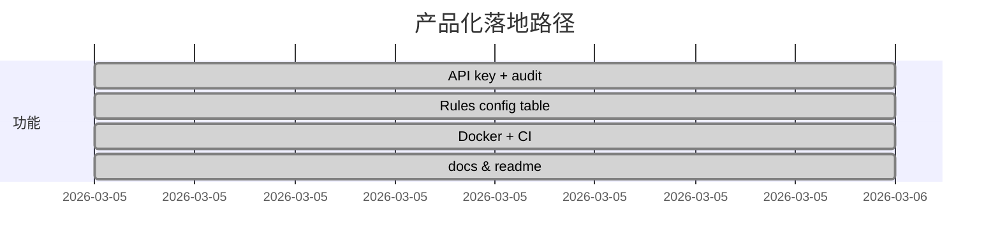

# Health Git MVP

持续交付的数据型健康干预系统，把 `Issue → Branch → Commit → PR → Merge` 语义搬到 toC/toD 的 AI Health 体验里，把用户「认可这个动作」抽象成可审计的数据，直接喂训练/评测。

## 产品价值
- 用户端提交的每个打卡、录入、设备数据都会变成 `care_commits`，并自动生成 `PR`、走安全 `Checks`、被 `reviewer` 明确 `Merge`，形成可靠的反馈信号。
- 规则云化：`check_rules` 表控制关键词/依从性阈值，reviewer 在 UI 或 API 调整后，结果立即更新，适合临床迭代。
- 通道化：API key、事件审计、metrics 看板、Docker、CI 让这个 MVP 可直接用于小规模部署或做能力 demo。

```mermaid
flowchart LR
  Consumer[Consumer (toC)] -->|submit commit| API[Health Git API]
  API -->|runs| Checks{Configurable rules}
  Checks -->|pass| Reviewer[Reviewer / doctor]
  Reviewer --> Merge[Merge Plan]
  Merge --> Metrics[Metrics + Events]
  Metrics --> Audit[Audit + docs]
```

## 用例
1. **慢病自管理闭环**：AI 教练把饮食/步行打卡当作 `commit`，冲上 `pr`， reviewer（健康管理师）决定是否 `merge` 进入下一个周计划。
2. **ToD 方案迭代**：医生调整运动/用药方案时，自动门禁检查 `insulin` 等关键词，合规后再合并，所有有 `events` 记录可追踪。
3. **训练/评测数据收集**：merge 代表用户+专家都认可的动作，可以直接构造评测样本、训练 reward model，将 `merge` 视为正强化事件。



## 快速运行
```bash
python3 -m venv .venv
source .venv/bin/activate
pip install -r requirements.txt
uvicorn app.main:app --reload --port 8090
```

打开 `http://127.0.0.1:8090` 体验 toC/toD 界面。

## 认证
默认不开启，需设置：
```bash
export AUTH_ENABLED=true
export CONSUMER_API_KEY=consumer-key
export REVIEWER_API_KEY=reviewer-key
```
发请求时带 `x-api-key`。

## API 端点
- `GET /api/health`
- `POST /api/seed`
- `GET /api/dashboard`
- `POST /api/commits`
- `POST /api/prs`
- `POST /api/prs/{pr_id}/review`
- `POST /api/outcomes`
- `GET /api/metrics`
- `GET /api/events?limit&offset&event_type`
- `GET /api/rules`
- `PATCH /api/rules/{rule_id}`

## 文档 & CI
- 本次开发纪录：`docs/2026-03-05-health-git-mvp.md`
- 自动化：`.github/workflows/ci.yml`（`pytest -q`）
- 生成镜像：`Dockerfile` + `uvicorn` 启动

## 发布提示
1. 参考 docs（`docs/2026-03-05-health-git-mvp.md`）整理 SKILL metadata 和 agent 行为。
2. 生成 `SKILL.md`（描述 intent、APIs、对话例子），用 `openclaw skill build` 打包 + `openclaw skill publish` 上传到 ClawHub registry。
*** End README
